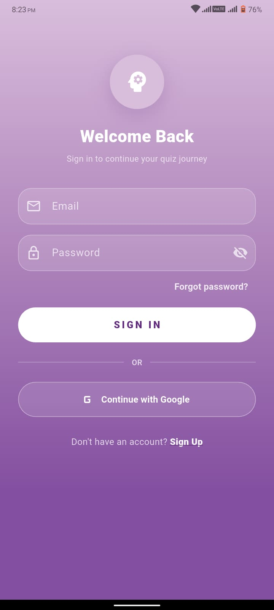
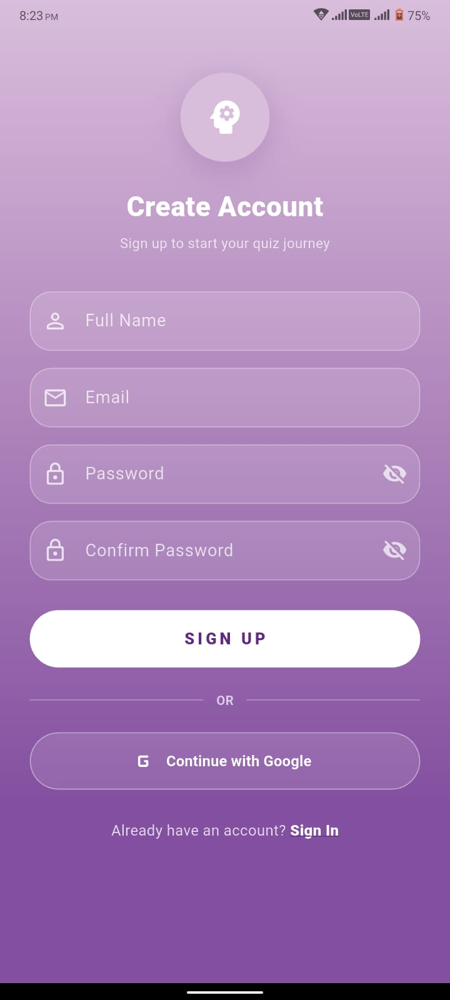
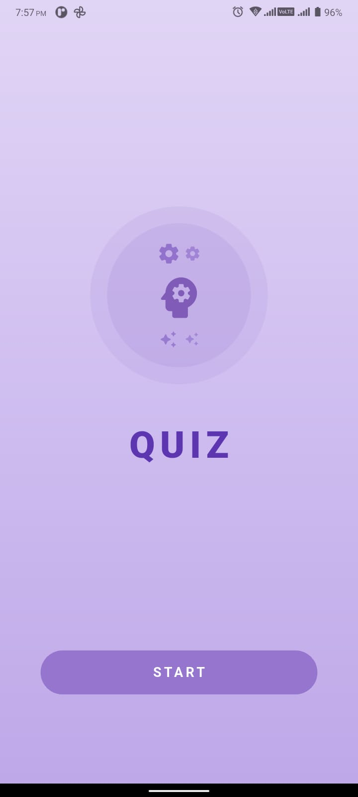
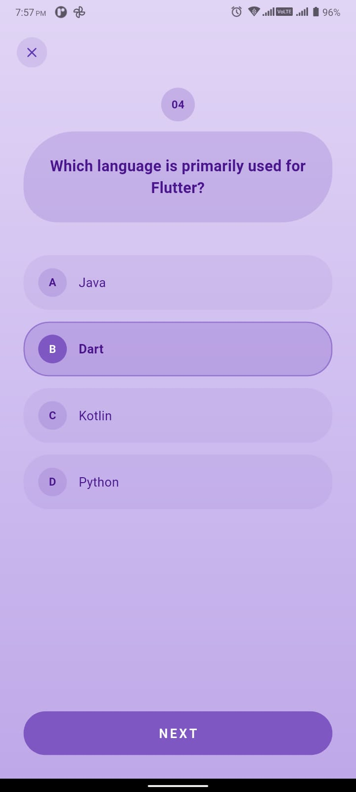
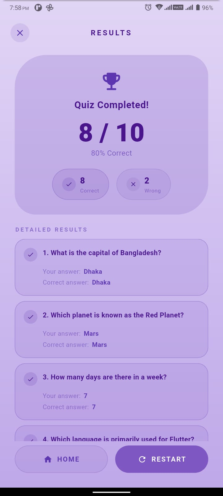

# Amar Proshno

### Flutter Quiz Application with BDApps Subscription Gating and AI Assistant

*A beautifully designed Flutter quiz application whose access is gated by a
Robi/Airtel Bangladesh mobile subscription through the existing BDApps PHP
backend, with an AI-powered chat assistant for short quiz hints.*

---

## 📱 Screenshots

<div align="center">
  <table>
    <tr>
      <td align="center">
        <strong>🔐 Phone Registration</strong>
      </td>
      <td align="center">
        <strong>📝 Subscription</strong>
      </td>
      <td align="center">
        <strong>🏠 Home</strong>
      </td>
    </tr>
    <tr>
      <td align="center">
        
      </td>
      <td align="center">
        
      </td>
      <td align="center">
        
      </td>
    </tr>
  </table>
</div>

<div align="center">
  <table>
    <tr>
      <td align="center">
        <strong>❓ Quiz</strong>
      </td>
      <td align="center">
        <strong>📊 Result</strong>
      </td>
      <td align="center">
        <strong>🤖 AI Assistant</strong>
      </td>
    </tr>
    <tr>
      <td align="center">
        
      </td>
      <td align="center">
        
      </td>
      <td align="center">
        
      </td>
    </tr>
  </table>
</div>

> The existing screenshots were captured for an older build. The current app
> uses **Phone Registration → Subscription → OTP → Home** instead of
> **Login → Sign Up → Home**.

---

## 📱 Overview

**Amar Proshno** is a multiple-choice quiz application built with Flutter.
Access to the entire quiz experience is gated by an **active BDApps mobile
subscription** through a fixed PHP backend. There is no email/password
authentication, no Firebase, no Google Sign-In — only a verified Robi or
Airtel mobile subscription.

The app demonstrates:

- 📲 **BDApps subscription gating** via `subscription/otp/request`,
  `subscription/otp/verify`, `subscription/getStatus`, and `subscription/send`
- ❓ **Interactive Quiz System** — multiple-choice questions with instant
  feedback
- 📊 **Detailed Results** — score tracking and per-question breakdown
- 🤖 **AI Assistant** — in-app chatbot restricted to short quiz hints and
  basic general knowledge
- 🎨 **Consistent UI** — soft purple/lavender gradient design throughout
- 🔒 **Home security** — Home is reachable only after the backend confirms
  `subscriptionStatus == REGISTERED`, and is re-validated on app start,
  resume, manual refresh, and every 3 hours

All quiz questions are stored locally. The subscription state is cached in
`SharedPreferences` for fast cold start but is **always** re-verified with
the backend before granting Home access.

---

## 🔌 Backend

The PHP backend lives at a fixed production URL and exposes four endpoints.
**Flutter never talks to BDApps directly** — it always goes through this
gateway. **The Flutter app must adapt to this backend; do not modify it.**

| Endpoint           | URL                                                           | Body (`application/x-www-form-urlencoded`) |
|--------------------|---------------------------------------------------------------|--------------------------------------------|
| Send OTP           | `POST https://appriyo.com/amarproshno/send_otp.php`           | `user_mobile`                              |
| Verify OTP         | `POST https://appriyo.com/amarproshno/verify_otp.php`         | `Otp`, `referenceNo`                       |
| Check Subscription | `POST https://appriyo.com/amarproshno/check_subscription.php` | `user_mobile`                              |
| Unsubscribe        | `POST https://appriyo.com/amarproshno/unsubscribe.php`        | `user_mobile`                              |

Critical rules:

- The PHP reads from `$_POST`. **Never** send JSON. Always use
  `Content-Type: application/x-www-form-urlencoded` with `body: {...}`.
- The Verify OTP body uses capital `O`: `Otp`, not `otp`. Every Flutter
  request must use the exact field name expected by the script.
- Phone numbers are normalised server-side from
  `8801XXXXXXXXX` / `8818XXXXXXXXX` to `01XXXXXXXXX`.

The four PHP files (`send_otp.php`, `verify_otp.php`,
`check_subscription.php`, `unsubscribe.php`) and their inbound webhook
companions live in `BDApps_SDK/`. **They are production code and must not
be modified, renamed, or replaced.**

---

## 🎨 Design Theme

The app uses a consistent **soft purple / lavender gradient** design
language across all screens:

- **Background Gradient** — Vertical: `#D9BEDC → #B086BC → #834FA0`
- **Primary Color** — Deep purple `#612A7E`
- **Secondary Color** — Medium purple `#B086BC`
- **Cards** — Gradient containers with rounded corners and translucent
  purple fills
- **Buttons** — Pill-shaped (`borderRadius: 30`) with filled and outlined
  variants
- **OTP Cells** — Translucent white squares with white borders
- **Chat Bubbles** — Rounded, direction-aware bubbles (white for user, deep
  purple for AI)
- **Typography** — Wide letter-spacing uppercase labels, white and purple
  text

---

## Application Flow

```
                  ▼
            SplashScreen
                  │
                  ▼
   SubscriptionController.bootstrap()
                  │
        ┌─────────┴───────────┐
        │                     │
   no phone cached      phone cached
        │                     │
        ▼                     ▼
  Phone Registration   check_subscription.php
        │                     │
        ▼                     ▼
   send_otp.php        REGISTERED? ─Yes─► Home
        │                     │           │
        ▼                     │           └─── Start Quiz ──► Quiz ──► Result
  OTP Verification     ─No───► Subscription  │
        │                     │               └─── AI Assistant ──► AI Chat
        ▼                     ▼
   verify_otp.php     (clear local cache)
        │
   REGISTERED?
        │
       Yes
        ▼
      Home
```

### Detailed steps

**Splash → Home (returning user with active subscription):**
1. `SubscriptionController.bootstrap()` checks `SharedPreferences`.
2. If a phone is cached, the controller calls `check_subscription.php`.
3. `subscriptionStatus == REGISTERED` → user goes straight to Home.
4. `UNREGISTERED` (or any other value) → local storage is wiped and the
   user is sent to the Subscription screen.

**Splash → Home (new user):**
1. No phone is cached → phone Registration.
2. User enters a Robi (018) or Airtel (016) number.
3. Phone Registration calls `send_otp.php`; on a returned `referenceNo` the
   user is taken to the OTP screen.
4. OTP screen calls `verify_otp.php`; on `REGISTERED` the user goes to
   Home.

**Home security gate:**
- Home is reachable **only** through `Get.offAllNamed(AppRoutes.home)` from
  inside the controller, and only when the backend has confirmed
  `REGISTERED`.
- The controller also validates on `AppLifecycleState.resumed`, on manual
  refresh from Settings, and on a 3-hour periodic timer.
- If the backend ever returns `UNREGISTERED` while the user is inside Home,
  the local cache is cleared and the user is redirected to the Subscription
  screen.

**Unsubscribe (Settings → Unsubscribe):**
1. Confirmation dialog.
2. `unsubscribe.php` is called.
3. Local cache is wiped.
4. The user is redirected to the Subscription screen.

---

## Features

### Splash Screen
- Cold-start entry point.
- Delegates routing decisions to `SubscriptionController.bootstrap()`.
- Shows the app logo + spinner while the bootstrap is in flight.

### Phone Registration Screen
- Captures a Robi (018) or Airtel (016) Bangladesh mobile number.
- Operator selector (Robi / Airtel) determines which prefix is enforced.
- Server-side normalisation accepted: `8801XXXXXXXXX`, `8818XXXXXXXXX`,
  or `01XXXXXXXXX`.
- Validates with regex `^01[3-9][0-9]{8}$`.
- On submit: calls `send_otp.php`, then navigates to the OTP screen when
  the backend hands back a `referenceNo`.

### Subscription Screen
- Marketing-style landing page with benefits, monthly price, and terms.
- Shows the current cached phone number (when present) via
  `SubscriptionStatusCard`.
- **Subscribe Now** button calls `send_otp.php` again if the user backed out
  of the OTP screen, then routes to the OTP screen.
- **Change phone number** link returns to Phone Registration.

### OTP Verification Screen
- Six-cell `OtpInput` with auto-focus and paste support.
- Resend button with a 60-second cooldown countdown.
- Calls `verify_otp.php` with the saved `referenceNo` and the user-typed
  `Otp`.
- On `statusCode == S1000` and `subscriptionStatus == REGISTERED` the user
  is sent to Home and the `subscriberId` is saved locally.

### Home Screen
- Gradient background with the QUIZ wordmark.
- **START** → fresh quiz session.
- **AI Assistant** → AI chat.
- **Settings** button (top-right) → Settings screen.

### Quiz Screen
- Question card with multiple-choice tiles A/B/C/D.
- `NEXT` / `SUBMIT` pill button.
- Optional close button.

### Result Screen
- Score, percentage, correct/wrong summary.
- Detailed per-question breakdown.
- `HOME` / `RESTART` actions.

### AI Assistant Screen
- In-app chatbot restricted to short quiz hints and basic general
  knowledge (one sentence, ~20 words), replying in the same language as
  the user (English or Bangla).
- Out-of-scope requests receive a fixed refusal message.
- Powered by the Kimchi AI API (`kimi-k2.6`).

### Settings Screen
- Shows the current `Subscription` snapshot (phone, subscriberId, last
  validation).
- **Refresh** → `validateSubscription(force=true)`.
- **Unsubscribe** → confirmation dialog → `unsubscribe.php` → cache wipe →
  redirect to Subscription screen.

---

## Project Structure

```
lib/
│
├── main.dart                                # GetX setup, routes, theme
│
├── config/
│   └── app_config.dart                      # baseUrl + timeouts + intervals
│
├── controllers/
│   ├── subscription_controller.dart         # Reactive subscription state machine
│   └── quiz_controller.dart                 # Quiz logic, scoring
│
├── models/
│   ├── subscription_model.dart              # Local Subscription snapshot
│   ├── bdapps_response_models.dart          # Typed responses for the four
│   │                                       #   PHP endpoints
│   ├── question.dart                        # Quiz question model
│   └── chat_message.dart                    # AI chat message model
│
├── data/
│   └── quiz_data.dart                       # Hardcoded quiz questions
│
├── services/
│   ├── bdapps_service.dart                  # Single HTTP service for BDApps
│   ├── api_exceptions.dart                  # Sealed exception hierarchy
│   ├── local_storage_service.dart           # SharedPreferences cache
│   └── ai_service.dart                      # Kimchi AI client (chat feature)
│
├── routes/
│   └── app_routes.dart                      # Named routes
│
├── screens/
│   ├── splash_screen.dart                   # Cold start
│   ├── phone_registration_screen.dart       # Robi/Airtel capture
│   ├── subscription_screen.dart            # Marketing landing
│   ├── otp_verification_screen.dart         # 6-digit OTP
│   ├── home_screen.dart                     # Quiz + AI buttons
│   ├── quiz_screen.dart                     # MCQ runner
│   ├── result_screen.dart                   # Score + breakdown
│   ├── settings_screen.dart                 # Refresh / Unsubscribe
│   └── ai_chat_screen.dart                  # Chat with AI Assistant
│
└── widgets/
    ├── app_background.dart                  # Gradient + AppBackground wrapper
    ├── subscription_status_card.dart        # Status summary card
    ├── otp_input.dart                       # Six-cell OTP input
    ├── countdown_timer.dart                 # MM:SS countdown
    └── option_tile.dart                     # Quiz option tile
```

---

## Dependencies

```yaml
dependencies:
  flutter:
    sdk: flutter
  get: 4.6.6                           # State management + navigation
  shared_preferences: ^2.2.3           # Local subscription cache
  http: ^1.2.0                         # BDApps + Kimchi AI HTTP
```

There is **no** Firebase, Firestore, Google Sign-In, or any auth package
in this app. Network access is provided exclusively by `package:http`.

---

## Getting Started

### Prerequisites
- Flutter SDK (3.0.0 or higher)
- Android Studio or VS Code
- Android Emulator or physical device

### Installation

1. Clone the project and fetch packages:
   ```bash
   flutter pub get
   ```

2. The BDApps backend URL is fixed in
   `lib/config/app_config.dart::AppConfig.baseUrl`. No further
   configuration is needed.

3. Run the app:
   ```bash
   flutter run
   ```

### Build APK (Android Release)

```bash
flutter build apk --release
```

### Build App Bundle (Google Play)

```bash
flutter build appbundle --release
```

---

## Subscription Flow (BDApps)

### Step 1 — Phone Registration
1. User picks Robi (018) or Airtel (016).
2. User enters the remaining 8 digits.
3. `BdappsService.sendOtp(phone)` issues:
   ```
   POST {baseUrl}/send_otp.php
   Content-Type: application/x-www-form-urlencoded
   user_mobile=01XXXXXXXXX
   ```
4. On `success == true` and a non-empty `referenceNo`, the user is taken
   to the OTP screen.

### Step 2 — OTP Verification
1. User enters the 6-digit OTP.
2. `BdappsService.verifyOtp(otp, referenceNo)` issues:
   ```
   POST {baseUrl}/verify_otp.php
   Content-Type: application/x-www-form-urlencoded
   Otp=123456
   referenceNo=ABC
   ```
3. On `statusCode == S1000` and `subscriptionStatus == REGISTERED` the
   `subscriberId` is saved locally and the user goes to Home.

### Step 3 — Home Security Gate
- On bootstrap, resume, manual refresh, and every 3 hours,
  `BdappsService.checkSubscription(phone)` issues:
  ```
  POST {baseUrl}/check_subscription.php
  user_mobile=01XXXXXXXXX
  ```
- The user is sent to Home only when the response's
  `subscriptionStatus == REGISTERED`. On `UNREGISTERED` the local cache is
  wiped and the user is sent back to the Subscription screen.

### Step 4 — Unsubscribe
1. Settings → Unsubscribe → confirm.
2. `BdappsService.unsubscribe(phone)` issues:
   ```
   POST {baseUrl}/unsubscribe.php
   user_mobile=01XXXXXXXXX
   ```
3. Local cache is wiped and the user is sent to the Subscription screen.

---

## AI Assistant Flow

1. User taps **AI Assistant** on the Home screen.
2. `AIChatScreen` opens with a greeting message from the assistant.
3. User types a message and taps Send.
4. `AiService.sendMessage(history)` posts to
   `https://llm.kimchi.dev/openai/v1/chat/completions` using model
   `kimi-k2.6`, with the full conversation history plus a fixed system
   prompt.
5. A loading indicator is shown while waiting for a response, and the Send
   button is disabled.
6. On success the AI's reply is appended as a left-aligned deep-purple
   bubble.
7. On timeout / API error / malformed response, a friendly fallback
   message is shown as an assistant bubble.

**Scope enforcement:** the system prompt restricts the assistant to short
quiz hints and basic general knowledge (max one sentence, ~20 words),
replying in the same language the user wrote in (English or Bangla).
Requests outside this scope (coding, math, essays, politics, medical/legal/
financial advice, roleplay, etc.) get a fixed refusal message.

---

## Error Handling

`SubscriptionController._humaniseError` translates raw exceptions into
user-friendly messages:

| Underlying failure                     | Message                                                            |
|----------------------------------------|--------------------------------------------------------------------|
| `SocketException` / `NetworkException` | "No internet connection. Please check your network and try again." |
| `TimeoutException` / "timed out"       | "Server is taking too long. Please try again."                     |
| `BadRequestException` (4xx)            | The server's `message` / `error` field, if present.                |
| `ServerException` (5xx)                | "Subscription service is unavailable. Please try again later."     |
| Anything else                          | "Something went wrong. Please try again."                          |

The BDApps service also handles:
- **Invalid phone** — caught by the registration screen validator and on
  the server side (`send_otp` / `check_subscription` reject with
  "Invalid mobile number format").
- **Wrong / expired OTP** — `verify_otp.php` returns
  `statusCode != S1000`; the controller maps that to an error message.
- **Already unregistered** — handled by `validateSubscription()`.
- **UNREGISTERED while at Home** — local cache is cleared and the user is
  redirected to the Subscription screen.

The AI Assistant handles its own error cases separately:
- **Request timeout** → "Request timed out. Please try again."
- **Non-200 API response** → "AI service error (`<status code>`). Please try again."
- **Empty/malformed API response** → "No response received. Please try again."
- **Any other failure** → "Something went wrong. Please try again."

These appear as assistant bubbles so the conversation isn't interrupted.

---

## State Management

- **GetX** for state management and navigation.
- `LocalStorageService`, `BdappsService`, and `SubscriptionController` are
  registered as permanent singletons via `Get.put` in `main.dart`.
- All public state on `SubscriptionController` is reactive (`Rx`, `RxBool`,
  `RxnString`, `RxInt`, `Rx<Subscription>`). UI binds through `Obx`.
- The controller mixes in `WidgetsBindingObserver` so it can re-validate
  on `AppLifecycleState.resumed`.
- A periodic `Timer.periodic(AppConfig.validationInterval)` runs
  `validateSubscription(silent: true)` while the app is in use.
- No `setState` is used in any of the new subscription screens.

---

## Local Storage

The app stores **only** the four fields the backend cares about, and
nothing else:

| Key                  | Type              | Source                                           |
|----------------------|-------------------|--------------------------------------------------|
| `phone`              | `String`          | Cached phone number from `send_otp.php`.         |
| `subscriberId`       | `String`          | `tel:88XXXXXXXXXX` returned by `verify_otp.php`. |
| `subscriptionStatus` | `String`          | `REGISTERED` / `UNREGISTERED` / `UNKNOWN`.       |
| `lastValidationTime` | `ISO 8601 string` | Set on every successful backend call.            |

The cache is **never** trusted on its own. Every protected screen is
reachable only after a successful backend verification.

---

## Security

- **No auth packages are bundled.** There is no Firebase, Firestore, or
  Google Sign-In.
- **No client-side secrets.** The BDApps application credentials live in
  the PHP backend, not in Flutter.
- **Home is gated by the backend.** Home is reached only via
  `Get.offAllNamed(AppRoutes.home)` from inside `SubscriptionController`,
  and only after a positive `check_subscription.php` response.
- **On UNREGISTERED, the cache is wiped** and the user is redirected to
  the Subscription screen — even if they had a previously-valid
  subscription that has since lapsed upstream.

---

## Troubleshooting

### OTP never arrives
- Check that the phone number is a valid Robi (018) or Airtel (016)
  Bangladesh number.
- Check the device's network connection.
- Confirm that the device can reach `https://appriyo.com/amarproshno/`
  directly via curl / Postman.

### "Subscription is currently inactive"
- The backend reports `UNREGISTERED`. Walk through the Subscription screen
  → Subscribe Now → OTP flow once to re-subscribe.

### OTP rejected as "S1301" / "invalid"
- The user typed the wrong code, or the code expired. Use the **Resend**
  button after the cooldown.

### AI Assistant always returns an error
- Check that the device has an active internet connection.
- Confirm the device can reach `https://llm.kimchi.dev`.

---

## Future Enhancements

- 🗄️ Quiz history backend (currently hardcoded questions).
- 📊 User statistics and analytics dashboard.
- 🏆 Leaderboard system.
- 🎯 Quiz categories and difficulty levels.
- 🌙 Dark mode theme.
- 🌍 i18n (Bengali, English) — the AI Assistant already mirrors the
  user's language.
- 📱 Offline support with question data caching.
- 💬 Persist AI chat history across sessions.
- 🔒 Move the AI API key to a secure backend/proxy instead of
  client-side storage.

---

<div align="center">

### Md. Shahajalal Mahmud

Flutter Developer • Android Developer • Founder, Appriyo

**Updated: BDApps Subscription Gateway + AI Assistant**

</div>
